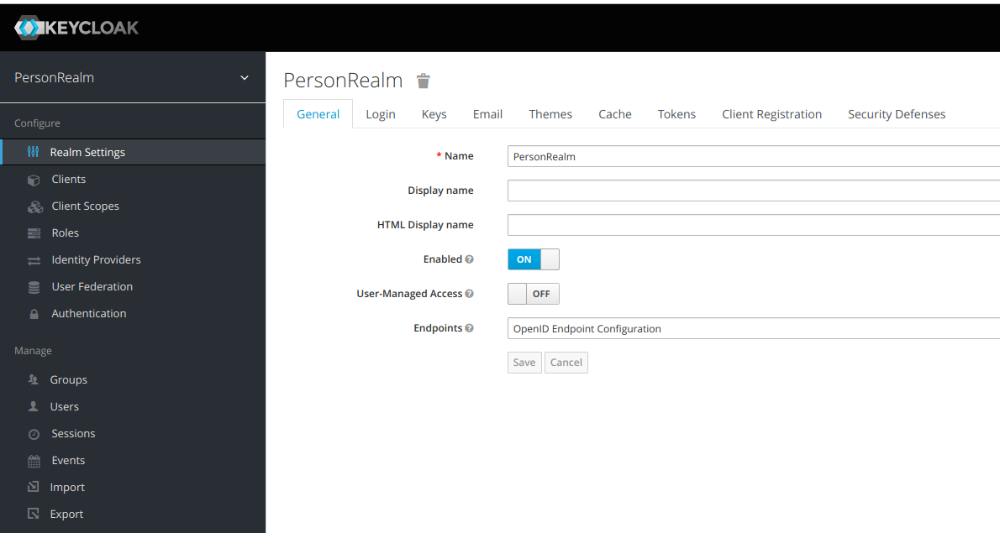

# springboot-keycloak-demo
This project explains how to use open source identity and access management using keycloak with springboot

### KeyCloak

> KeyCloak is a open source identity and access management for modern applications and services.
>
>Add authentication to applications and secure services with minimum fuss. No need to deal with storing users or authenticating users. It's all available out of the box.
>You'll even get advanced features such as User Federation, Identity Brokering and Social Login.
>It's easy by design

Refer this link https://www.keycloak.org


### KeyCloak Setup

I am using docker-compose.yml to run KeyClock in docker container.

docker-compose.yml

```
version: '3'

services:

  keycloak:
    image: jboss/keycloak
    restart: on-failure
    command:
      - "-b"
      - "0.0.0.0"
      - "-Dkeycloak.migration.action=import"
      - "-Dkeycloak.migration.provider=dir"
      - "-Dkeycloak.migration.dir=/config/"
      - "-Dkeycloak.migration.strategy=IGNORE_EXISTING"
    volumes:
      - ./config:/config/
    environment:
      - KEYCLOAK_USER=admin
      - KEYCLOAK_PASSWORD=password
      - DB_VENDOR=postgres
      - DB_USER=admin
      - DB_PASSWORD=password
      - DB_ADDR=keycloak-db
      - DB_PORT=5432
      - DB_DATABASE=keycloakdb
    ports:
      - "8081:8080"
    depends_on:
      - keycloak-db

  keycloak-db:
    image: postgres:10
    environment:
      POSTGRES_USER: admin
      POSTGRES_PASSWORD: password
      POSTGRES_DB: keycloakdb
    volumes:
      - pgdata:/var/lib/postgresql/data

volumes:
  pgdata:

```

**Note:** I have mentioned **config** in yml file where you can keep your keycloak settings as a json file so that it will be imported in keycloak admin portal when running the docker composer file.

Here config was empty because I configured directly from the KeyCloak Adminstration console.

**KeyCloak Adminstration console** : **Username** : _admin_ and **Password** : _password_

```
docker-compose -f docker/docker-compose.yml up

```

KeyCloak can be accessed on this url

**_http://localhost:8081/auth/_**


### Application Demo

In this application, I have used keycloak in springboot. In this demo, I have explained how the urls has been redirected based on different user which are configured in keycloak for authentication and authorization.

Here I am using 

* springboot 2.1.1
* java8
* keycloak 4.8.2

**Maven dependencies to connect springboot and keycloak**

```
<dependency>
    <groupId>org.keycloak</groupId>
	<artifactId>keycloak-spring-boot-starter</artifactId>
	<version>4.8.2.Final</version>
</dependency>
<dependencyManagement>
	<dependencies>
	<!-- https://mvnrepository.com/artifact/org.keycloak.bom/keycloak-adapter-bom -->
	    <dependency>
			<groupId>org.keycloak.bom</groupId>
			<artifactId>keycloak-adapter-bom</artifactId>
			<version>4.8.2.Final</version>
			<type>pom</type>
			<scope>import</scope>
		</dependency>
	</dependencies>
</dependencyManagement>

```

**_KeyCloakConfig.java_**

```
@Configuration
@ComponentScan(
        basePackageClasses = KeycloakSecurityComponents.class,
        excludeFilters = @ComponentScan.Filter(type = FilterType.REGEX, pattern = "org.keycloak.adapters.springsecurity.management.HttpSessionManager"))
@EnableWebSecurity
public class KeyCloakConfig extends KeycloakWebSecurityConfigurerAdapter {


    /**
     * Registers the KeycloakAuthenticationProvider with the authentication manager.
     */
    @Autowired
    public void configureGlobal(AuthenticationManagerBuilder auth) throws Exception {
        KeycloakAuthenticationProvider keycloakAuthenticationProvider = keycloakAuthenticationProvider();

        // adding proper authority mapper for prefixing role with "ROLE_"
        keycloakAuthenticationProvider.setGrantedAuthoritiesMapper(new SimpleAuthorityMapper());

        auth.authenticationProvider(keycloakAuthenticationProvider);
    }


    @Bean
    @Override
    protected SessionAuthenticationStrategy sessionAuthenticationStrategy() {
        return new RegisterSessionAuthenticationStrategy(new SessionRegistryImpl());
    }


    /**
     * Use properties in application.properties instead of keycloak.json
     */
    @Bean
    public KeycloakConfigResolver KeycloakConfigResolver() {
        return new KeycloakSpringBootConfigResolver();
    }

    /**
     * Secure appropriate endpoints
     */
    @Override
    protected void configure(HttpSecurity http) throws Exception {
        super.configure(http);
        http.authorizeRequests()
                .antMatchers("/persons*").hasRole("user") // only user with role user are allowed to access
                .antMatchers("/products").hasRole("product")
                .anyRequest().permitAll();
    }

}

```

**_application.properties_**

```
keycloak.auth-server-url=http://127.0.0.1:8081/auth
keycloak.resource=person-app
keycloak.realm=PersonRealm
keycloak.public-client=true
keycloak.principal-attribute=preferred_username
server.port=8090

```


**_Screenshots:_**

1. Create new realm


2. Created PersonRealm in Keycloak Administrative console



3. Create Client to access URL based on roles


4. Create Roles - here i have created user and product roles


5. Create Users - here you can create users
   
Here I have created 2 users. One user can access only Persons link and Other user can access only Products link in the application demo.


6. Application Screenshot


### Happy Coding